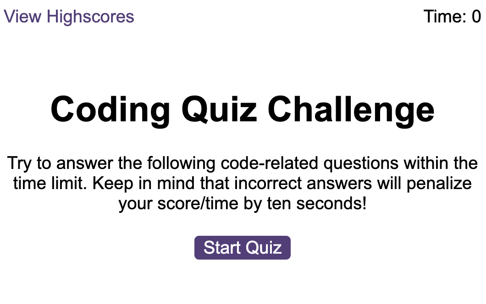

# Week 06 Challenge: Web APIs: Code Quiz

To help myself become familiar with these tests and give me a chance to apply the skills from this module, this week’s challenge invites me to build a timed coding quiz with multiple-choice questions. This app will run in the browser, and will feature dynamically updated HTML and CSS powered by JavaScript code that I write. It will have a clean, polished, and responsive user interface. This week’s coursework has taught me all the skills I need to succeed in this challenge.

As I proceed in my journey to becoming a front-end web developer, it’s likely that I’ll be asked to complete a coding assessment, perhaps as part of an interview process. A typical coding assessment is a combination of multiple-choice questions and interactive coding challenges. 

## Description

This project takes on the 6th week challenge which is creating a code quiz web app.

## User Story

💀💀💀
AS A coding boot camp student
I WANT to take a timed quiz on JavaScript fundamentals that stores high scores
SO THAT I can gauge my progress compared to my peers
💀💀💀

### Essential information

## Links/Submission

* REPO: https://github.com/i-k-dev/code-quiz
* PAGE: https://i-k-dev.github.io/code-quiz/

## Acceptance Criteria

Critical requirements necessary to develop this password generator app that satisfies the grades:

* A start button that when clicked a timer starts and the first question appears. 🧐/⛔️
 * Questions contain buttons for each answer. 🧐/⛔️
* When answer is clicked, the next question appears. 🧐/⛔️
* If the answer clicked was incorrect then subtract time from the clock. 🧐/⛔️
* The quiz should end when all questions are answered or the timer reaches 0. 🧐/⛔️
* When the game ends, it should display their score and give the user the ability to save their initials and their score. 🧐/⛔️
* Fail at creating a simple Javascript app again. ✅

## Screenshots

Preview of whole site:

## Author

Contributor names and contact info

Ishqha Khidzr  
@ this-github-user :-)

## Thanks
